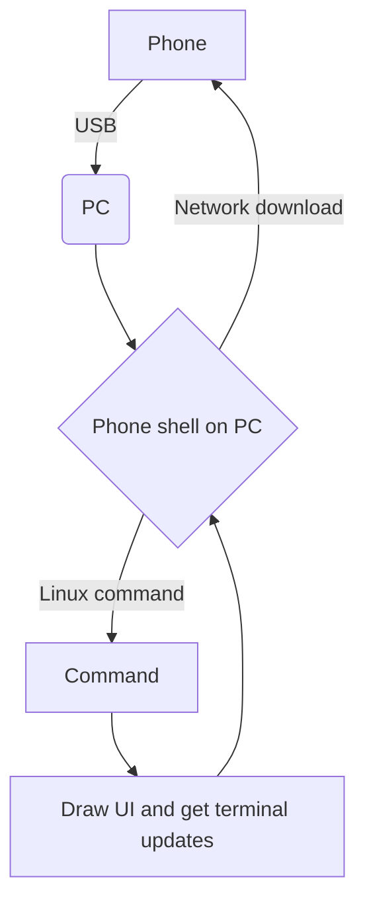

# Geometric
### Linux OS for phones

### Concept
A linux distro phone that you plug into your computer to send commands to. It shows the currect task in a GUI dashboard on supported commands (ollama, curl, etc), it also supports voice assistant etc. etc.
